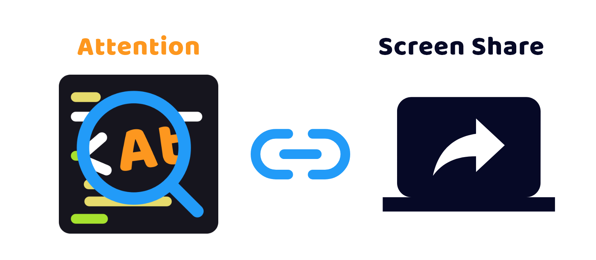

# Attention


## Access

Here -> [Attention](https://attention-0fbcf9.an.r.appspot.com/)

## What's `Attention` ?

The code editor for presentation.

This editor allows you to display the code you want to stand out by simply selecting a line of code.

## Description

You found it difficult to see the presenter's code because of the letters are too small.  
Have you ever this kind of experience?

`Attention` can solve it.

Enlarged code letters are displayed by selecting code lines of editor.

Also, maybe you can try using this when share the screen on video communication tool.



## Setup and Run

```bash
$ npm install

$ npm run dev

# access localhost:3000 in your browser
```
